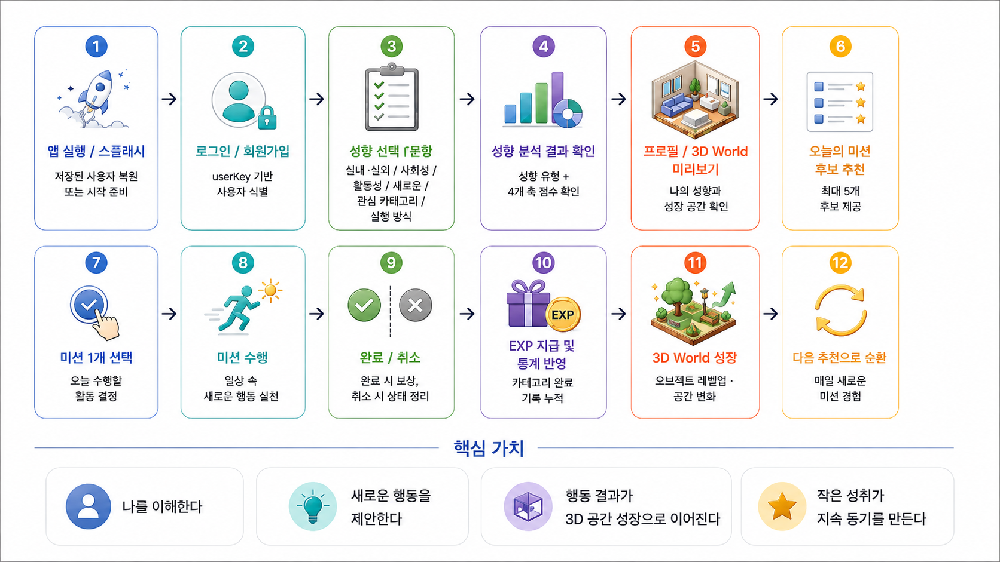
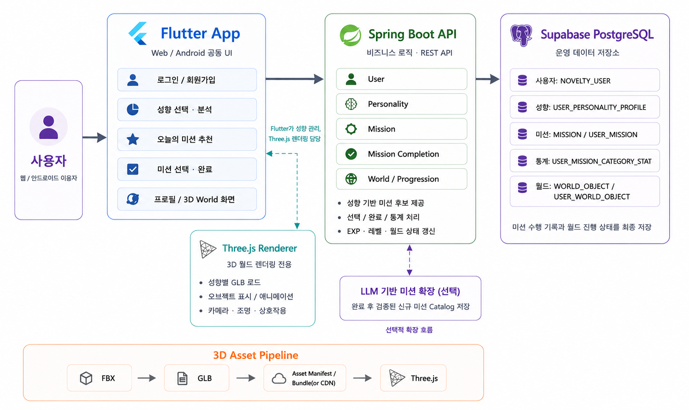

# Novelty


새로운 자극을 소비하는 대신, 새로운 경험을 만들어보면 어떨까?
우리는 지루하거나 무기력할 때 자연스럽게 새로운 콘텐츠와 자극을 찾습니다.
하지만 화면 속 새로운 자극이 아니라, 내가 직접 행동하며 만들어가는 작은 변화가 일상에 더 오래 남을 수 있다고 생각했습니다.

무엇을 해야 할지 모르겠는 날에도 부담 없이 작은 미션 하나를 고르고,
평소라면 하지 않았을 행동을 직접 해보며
“나 이런 것도 해보네?”라는 작은 발견을 쌓아가는 것.

노벨티는 그렇게 일상에 새로운 행동을 더해 삶의 활력을 되찾는 경험을 만들고자 시작했습니다.

Novelty는 사용자의 성향을 바탕으로 평소와 다른 행동을 제안하고, 미션을 완료할수록 개인의 3D World가 성장하는 서비스입니다.

## 핵심 사용자 흐름


## 아키텍쳐


## 9개의 성향과 공간


## 바로가기

<table>
  <tr>
    <td align="center" width="50%">
      <a href="https://kyeongseoj.dx6project.site/">
        <br>
        <strong>Novelty WebApp</strong>
      </a><br>
      <sub>서비스 바로가기</sub>
    </td>
    <td align="center" width="50%">
      <a href="https://kyeongseoj-api.dx6project.site/swagger-ui/index.html">
        <br>
        <strong>Backend Swagger UI</strong>
      </a><br>
      <sub>API 문서 및 테스트</sub>
    </td>
  </tr>
</table>

## 문서 안내

현재 기준 문서를 목적별로 나누어 관리합니다.

| 문서 | 확인할 내용 |
|---|---|
| [프로젝트 가이드](docs/guide.md) | 프로젝트 구조, 환경 변수, 로컬 실행, Docker 배포, API 경계 |
| [통합 사양](docs/SPEC.md) | 현재 제품·기술 정책과 구현 기준 |
| [프로젝트 상태](docs/PROJECT_STATUS.md) | 기능별 구현·검증 상태와 알려진 범위 |
| [기술 구조](docs/ARCHITECTURE.md) | 시스템 구성과 책임 경계 |
| [SDD 문서](docs/SDD/) | 버전별 기능 상세 설계와 인수 조건 |

## 추후 발전 계획
- Novelty Report 제공할 예정입니다. 
  - 한달간의 미션 수행 내용을 정리해 나의 변화를 더 잘 발견하게 해줄 예정입니다.
```
8월의 당신

새로운 활동 21개 경험
가장 많이 시도한 영역: CREATIVE
가장 적게 시도한 영역: SOCIAL
평소보다 활동적인 미션 선택 +18%
평균 활동시간 23분

이번 달 처음 해본 것
· 새로운 산책길 걸어보기
· 평소 듣지 않던 장르 음악 듣기
· 새로운 메뉴 직접 만들어보기

이번 달 당신의 세계가 조금 넓어졌습니다.
```
- 수행한 미션 내용을 기록할 수 있는 게시글 공간을 만들고 추후 유저 커뮤니티로 확장되면 좋겠다는 생각을 하고 있습니다.


  ----
  본 프로젝트는 바이브 코딩으로 제작된 프로젝트이며 수익창출을 목적으로 제작되지 않았습니다.
